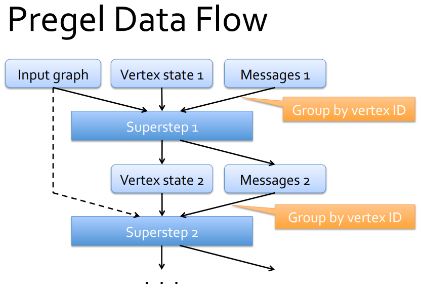

## Graphs


This was the original Spark implementation of Pregel. 
## Pregel 

Pregel comes from "parallel, graph, google". There are many tutorials on Pregel API, and here is [one good explanation](https://www.cakesolutions.net/teamblogs/graphx-pregel-api-an-example): 

> Pregel employs a vertex-centric approach in processing large distributed graphs. As described in this paper, Pregel computations consist of a sequence of iterations, called supersteps. During a superstep, the following can happen in the framework:

> It receives and reads messages that are sent to V from the previous superstep S-1.
> It applies a user-defined function f to each vertices in parallel, so f essentially specifies the behaviour of a single vertex V at a single superstep S.
> It can mutate the state of V.
> It can send messages to other vertices (typically along outgoing edges) that the vertices will receive in the next superstep S+1.
> In this approach, all communations are between supersteps S and S+1. Within each superstep, the same user-defined function f is applied to all of the vertices in parallel.


```
  def pregel[A](initialMsg: A, maxIterations: Int, activeDirection: EdgeDirection)(
      vprog: (VertexId, VD, A) => VD,         
      sendMsg: EdgeTriplet[VD, ED] => Iterator[(VertexId,A)],
      mergeMsg: (A, A) => A)
```

We will look at 3 applications of pregel: 
1. [find maximum value among vertices](https://www.cakesolutions.net/teamblogs/graphx-pregel-api-an-example)
2. [PageRank](https://www.safaribooksonline.com/library/view/apache-spark-graph/9781784391805/ch06s04.html)
3. [Shortest path length from a single point](https://spark.apache.org/docs/latest/graphx-programming-guide.html#pregel-api)

vprog examples: 
```
/// min value: 
(id, (newmin, oldmin), msg)  =>  (msg min oldmin, newmin)

/// DSSP: 
(id, dist, newDist) => math.min(dist, newDist)

/// PageRank: 
(id, (oldPR, lastDelta), msgSum) => (oldPR + 0.85 * msgSum, newDelta)  //where newDelta = newPR - oldPR
```


sendMsg examples
```
// min value: 
def sendMsg(triplet: EdgeTriplet[(Int, Int), Boolean]): Iterator[(VertexId, Int)] = {
  val sourceVertex = triplet.srcAttr

  if (sourceVertex._1 == sourceVertex._2)    Iterator.empty
  else                                       Iterator((triplet.dstId, sourceVertex._1))}

// DSSP: 
triplet => { 
    if (triplet.srcAttr + triplet.attr < triplet.dstAttr)    Iterator((triplet.dstId, triplet.srcAttr + triplet.attr))
    else Iterator.empty}

// PageRank:
edge =>   {if (edge.srcAttr._2 > tol)    Iterator((edge.dstId, edge.srcAttr._2 * edge.attr))
           else    Iterator.empty}
```


mergeMsg examples: 
```
// min value: 
def mergeMsg(msg1: Int, msg2: Int): Int = msg1 min msg2
// DSSP: 
(a, b) => math.min(a, b)
// PageRank: 
(a, b) => a + b
```

## GraphX

## GraphX concepts

- `VertexRDD[VD]` - distributed collection of vertices of type `VD` - can be Int, String, tuples etc. Each vertex has an id of type Long, but can also have properties of type VD. 
- `EdgeRDD[ED]` - distributed collection of edges of type `ED`. Each edge also has an id of type Long, and can have properties. 
- triplet = an edge with its two vertices. `EdgeTriplet[VD, ED]`


## GraphFrames

This is a 3rd-party package that is not part of Spark source code. Like many user-contributed packages, it lives on [Spark-packages website](). The command to start spark-shell with the package loaded can be found on its web page and is in my case: 
```./bin/spark-shell --packages graphframes:graphframes:0.6.0-spark2.3-s_2.11```
In order to get the functions from the package we import the module. All the docs can be found at the [graphframes project web page](http://graphframes.github.io/). 
```import org.graphframes._```

Graphframes allows you to: 
- treat vertices and their properties like a DataFrame and use SQL queries
- treate edges and their properties like a DataFrame and use SQL queries
- use Cypher-like queries for finding motifs in the graph - Cypher is like SQL for graphs, it's a propriatory language for Neo4J, but very intuitive. 
- run some graph algorithms

## Loading Graphs

- data to use - [Ford Go bikes in San Francisco](https://member.fordgobike.com/map/)
- vertices = stations (314 distict stations)
- edges = rides (185k rides in Sep 2018)
- as GraphFrame : `GraphFrame( vertexDF, edgeDF)` - where vertexDF has to have an `id` column, and edgeDF has to have `src` and `dst` columns. 
- can convert to GraphX with `toGraphX` method


## Networkx

networkx is probably the best known graph library out there. It's written in python and it has many examples and functionalities implemented. Check out the [examples](https://networkx.github.io/documentation/stable/auto_examples/index.html). 
- you have graph generators that easily generate different graphs
- you have good visualization capabilities
- you have plenty of algorithms implemented already - check out [basic ones](https://networkx.github.io/documentation/stable/auto_examples/basic/plot_properties.html) such as diameter


(https://spark.apache.org/docs/latest/graphx-programming-guide.html#pregel-api)

## Ford Go Bike 

- [data download](https://www.fordgobike.com/system-data)
- [map of bike stations](https://member.fordgobike.com/map/)


